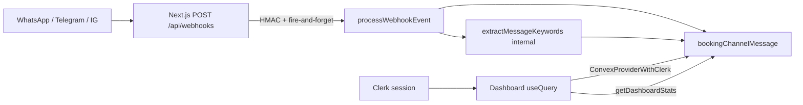

# Ivano PMS — Phase 1 Week 2 Kickoff

**Window:** July 1–7, 2026 | **Phase:** 1 Week 1 (calendar week 2) | **Gate:** EOD Friday July 4, 2026

---

## Schema / seed cross-check (answer to your question)

**Nine core tables — production-ready for Week 2.** [`convex/schema.ts`](convex/schema.ts) already includes NLP fields on `bookingChannelMessage` (`extractedCheckIn`, `extractedCheckOut`, `extractedGuestNames`, `extractedUnitType`), booking status union, and indexes needed for dashboard/calendar queries.

**Seed fixtures — not Week-2-ready yet.** Current [`convex/seed.ts`](convex/seed.ts) has:

| Entity | Current | Week 2 target |
|--------|---------|---------------|
| `property` | 1 (Gwarimpa Estate) | 1 (single-property MVP; name TBD) |
| `unit` | 10 | 10 (keep) |
| `guest` | 5 | 5–8 |
| `booking` | 3 (confirmed, pending_confirmation, inquiry) | **5–8** across all status values |
| `bookingChannelMessage` | 2 (no NLP fields populated) | **10–15** with varied channels + NLP-friendly text |
| `manager` | 1 (placeholder `clerkUserId`) | 1 linked to real Clerk user via upsert |

**Gaps to close in Task 2.1:**

- No `ConvexProviderWithClerk` — only [`ClerkProvider`](apps/web/src/app/layout.tsx) + stub [`convex.ts`](apps/web/src/convex.ts)
- Public Convex queries (`getBookings`, `getChannelMessages`, etc.) have **no auth checks** — must wrap before exposing to UI
- No `getDashboardStats` aggregate query
- No NLP extraction logic (fields exist, always empty)
- Duplicate route trees: [`apps/web/src/app/dashboard/`](apps/web/src/app/dashboard/) and [`apps/web/src/app/(dashboard)/dashboard/`](apps/web/src/app/(dashboard)/dashboard/) — consolidate to `/dashboard/*` only

**Verdict:** Schema is ready; seed + auth + provider wiring are Week 2 prerequisites, not blockers for planning.

---

## Locked decisions (pre–Task 2.1)

These seven clarifications are **final** for Week 2 execution.

### 1. Seed NLP population — backfill, not pre-compute

- **Task 2.1:** Seed 10–15 `bookingChannelMessage` rows with **rich natural-language text only** (`messageText`). Do **not** set `extractedCheckIn`, `extractedCheckOut`, `extractedGuestNames`, or `extractedUnitType` in seed inserts.
- **Task 2.4:** Run `backfillMessageNlp` internal mutation on all seed messages after extractor is implemented.
- **Rationale:** Keeps seed focused on fixtures; extraction logic lives in one place.

### 2. Calendar status color map (locked)

Use in `booking-calendar.tsx` via shared constant `BOOKING_STATUS_COLORS`:

| `booking.status` | Background | Text |
|------------------|------------|------|
| `inquiry` | `bg-yellow-100` | `text-yellow-800` |
| `pending_confirmation` | `bg-amber-100` | `text-amber-800` |
| `confirmed` | `bg-green-100` | `text-green-800` |
| `checked_in` | `bg-blue-100` | `text-blue-800` |
| `checked_out` | `bg-slate-100` | `text-slate-700` |
| `completed` | `bg-emerald-100` | `text-emerald-800` |
| `cancelled` | `bg-red-100` | `text-red-700` |

### 3. Occupancy rate formula (locked)

`getDashboardStats` computes **today's occupancy** (not rolling, not 30-day projection):

```
occupancyRate = occupiedUnitsToday / totalUnits
```

Where `occupiedUnitsToday` = count of distinct `unitId` values with an active booking on `today` (ISO date string passed from client):

- `status` in `confirmed`, `checked_in`, `pending_confirmation`
- `checkInDate <= today`
- `checkOutDate` is undefined OR `checkOutDate > today`

`totalUnits` = count of `unit` rows for `propertyId`. Return `occupancyRate` as 0–1 float; UI displays as percentage.

`revenueNgn` = sum of `totalPriceNgn` for bookings with `status` in `confirmed`, `checked_in`, `checked_out`, `completed` where `checkInDate <= today <= checkOutDate` (or open-ended checkout).

### 4. INTERNAL_JOB_SECRET wiring (locked — not Convex admin key)

**Important:** `INTERNAL_JOB_SECRET` is a **shared secret string** you generate (e.g. `openssl rand -hex 32`), **not** the Convex deployment admin key.

| Location | Variable | Purpose |
|----------|----------|---------|
| Convex dashboard → Settings → Environment | `INTERNAL_JOB_SECRET` | Validated by [`assertInternalJobSecret`](convex/lib/secrets.ts) in mutations |
| `apps/web/.env.local` | `INTERNAL_JOB_SECRET` | Passed to Convex via `ConvexHttpClient` in webhook handler |
| `.env.example` | Both secrets documented | Team onboarding |

**Guard pattern for dev-only mutations** (`seedReset`, `backfillMessageNlp`, `seedDemoDataV2`):

```typescript
// internalMutation only — never public API
export const seedReset = internalMutation({
  args: { secret: v.string() },
  handler: async (ctx, args) => {
    assertInternalJobSecret(args.secret);
    // ... delete seed tables in FK-safe order
  },
});
```

Webhook path unchanged: `processWebhookEvent` receives `secret` from Next.js; dashboard queries use **Clerk JWT** via `authedQuery`.

Document in Task 2.1: update [`.env.example`](.env.example) and [`DEVELOPMENT.md`](DEVELOPMENT.md).

### 5. Task 2.5 testing strategy (locked)

| Tier | Scope | Budget | Required? |
|------|-------|--------|-----------|
| **Primary** | Extend [`scripts/test-webhook.mjs`](scripts/test-webhook.mjs) → verify Convex row via `ConvexHttpClient` poll | ~2h | **Yes** |
| **Stretch** | Playwright: Clerk sign-in → dashboard pending count +1 after webhook | ~3–4h | Optional |

Primary acceptance: webhook POST 200 → new `bookingChannelMessage` with `status: "new"` within 2s (Convex poll). UI latency <500ms is **stretch** for Playwright only.

### 6. Clerk test user setup (locked)

Document in Task 2.1 / [`DEVELOPMENT.md`](DEVELOPMENT.md):

1. Clerk Dashboard → **Users** → create test manager (email + password)
2. Sign in at `http://localhost:3000/sign-in` → triggers `upsertManagerFromClerk`
3. Convex: ensure `manager.clerkUserId` matches signed-in user's Clerk ID (or run upsert on first dashboard visit)
4. Convex dashboard → **Settings → JWT** → configure Clerk issuer (`CLERK_JWT_ISSUER_DOMAIN`) for Convex auth
5. Vercel preview: add same Clerk keys + add preview URL to Clerk allowed origins

For Playwright stretch: store `CLERK_TEST_USER_EMAIL` / `CLERK_TEST_USER_PASSWORD` in `.env.local` (gitignored); never commit.

### 7. Pending messages UI edge case (locked)

- **Stat card:** shows total `pendingMessageCount` from `getDashboardStats` (all `status: "new"`)
- **List widget:** shows **latest 5** by `createdAt` desc
- **Badge:** stat card displays total even when list is truncated (e.g. "12 pending")
- **"View all":** deferred to Week 3 channel inbox page — no link in Week 2 MVP

---

## Pre–Task 2.1 checklist

- [x] Calendar status → Tailwind color map defined
- [x] Occupancy formula: today's occupied units / total units
- [x] INTERNAL_JOB_SECRET documented (shared secret, not admin key)
- [x] Task 2.5: HTTP verification primary; Playwright stretch
- [ ] Create Clerk test user before Day 1
- [x] Seed: NLP via Task 2.4 backfill (not pre-compute in seed)

---

## Updated architecture assumptions (post Week 1 revision)



- **No Railway / Express** — webhooks and UI deploy together on **Vercel**
- Webhook auth: `WEBHOOK_SECRET` (HMAC) + `INTERNAL_JOB_SECRET` (mutation)
- Dashboard auth: Clerk `userId` → `manager` table via `by_clerk_user` index
- Property scope: `DEFAULT_PROPERTY_ID` env + single seeded property

---

## Week 2 task breakdown

| Task | Duration | Owner | Deliverable |
|------|----------|-------|-------------|
| **2.1** Convex + Clerk wiring | 1.5 days | Dev A | Provider, auth wrappers, seed v2, route cleanup |
| **2.2** Dashboard home | 1 day | Dev B | Live stats from seed + reactive pending messages |
| **2.3** Booking calendar | 1.5 days | Dev B | 30-day units×dates grid, click-to-create |
| **2.4** NLP keyword extraction | 1 day | Dev A | Regex extractor on webhook insert + backfill seed |
| **2.5** Smoke test + deploy validation | 0.5 day | Dev C / solo | HTTP webhook→Convex verification (required) + Playwright stretch |

**Suggested commits (5):**

1. `feat: wire ConvexProviderWithClerk and manager auth`
2. `feat: expand seed data and add dashboard stats query`
3. `feat: build dashboard overview with live Convex data`
4. `feat: add booking calendar with click-to-create`
5. `feat: NLP extraction on channel messages + E2E smoke test`

---

## Task 2.1 — Convex provider wiring + Clerk integration

**Duration:** 1.5 days

### Acceptance criteria

- [`ConvexProviderWithClerk`](https://docs.convex.dev/auth/clerk) wraps dashboard in root or dashboard layout
- Signed-in Clerk user maps to `manager` row; unauthorized users see error state (not empty data)
- `convex/lib/auth.ts` + `authedQuery` / `authedMutation` wrappers protect all dashboard-facing functions
- Seed v2: **1 property**, **5–8 bookings**, **10–15 messages** with NLP-friendly `messageText` only (no extracted fields — Task 2.4 backfills)
- `seedReset` internalMutation guarded by `assertInternalJobSecret` (see Locked decisions §4)
- Clerk test user setup documented in `DEVELOPMENT.md`
- Duplicate `(dashboard)/dashboard` routes removed; `/dashboard/*` is canonical
- `pnpm lint:convex` and `pnpm build:web` pass

### Cursor prompt 2.1

```
Task: Wire Convex + Clerk for Ivano PMS dashboard (Phase 1 Week 2, Task 2.1).

Context:
- Stack: Next.js 16 + Clerk + Convex (no Express/Railway)
- Schema: 9 tables in convex/schema.ts — property, unit, guest, booking, bookingChannelMessage, manager, checklist, occupancySnapshot, auditLog
- Webhook flow (already working): POST /api/webhooks → HMAC verify → processWebhookEvent mutation → bookingChannelMessage (status: new). See docs/webhooks.md
- Dashboard routes: apps/web/src/app/dashboard/* (placeholder pages). Clerk gate in dashboard/layout.tsx
- convex.ts exists but ConvexProviderWithClerk is NOT wired yet
- Public queries in convex/functions/* have NO auth — must fix before UI reads

Actions:

1. Install convex-helpers if missing. Create convex/lib/auth.ts:
   - getCurrentManager(ctx): ctx.auth.getUserIdentity() → lookup manager by clerkUserId (index by_clerk_user)
   - Throw "Not authenticated" / "Not authorized for this property" as appropriate

2. Create convex/lib/customFunctions.ts with authedQuery and authedMutation wrappers.

3. Refactor dashboard-facing functions to use authed wrappers:
   - convex/functions/bookings.ts: getBookings, createBooking
   - convex/functions/channelMessages.ts: getChannelMessages (NOT convertChannelMessageToBooking — Week 3)
   - convex/functions/property.ts: getProperty
   - convex/functions/occupancy.ts: getOccupancySnapshot
   - Add convex/functions/dashboard.ts: getDashboardStats({ propertyId, today }) returning { occupancyRate, revenueNgn, pendingMessageCount, bookingCountByStatus }
   - Occupancy formula (locked): occupiedUnitsToday / totalUnits where booking is active on `today` (see Locked decisions §3). Client passes `today` as ISO YYYY-MM-DD.

4. apps/web: Add ConvexProviderWithClerk in layout (ClerkProvider must wrap it). Use NEXT_PUBLIC_CONVEX_URL.

5. Create apps/web/src/components/providers/convex-client-provider.tsx (client component pattern).

6. Add convex/functions/managers.ts: upsertManagerFromClerk (mutation on first dashboard login — email, fullName from Clerk identity).

7. Expand convex/seed.ts → seedDemoDataV2 internalMutation (guarded by assertInternalJobSecret):
   - 1 property (single-property MVP; name placeholder OK)
   - 10 units (keep existing mix)
   - 5–8 guests
   - 5–8 bookings spanning: inquiry, pending_confirmation, confirmed, checked_in, checked_out, cancelled
   - 10–15 bookingChannelMessage rows with rich messageText ONLY (e.g. "July 15 for 2 nights", "villa for Ada Okonkwo next weekend") — leave extracted* fields empty; Task 2.4 backfills
   - seedReset internalMutation: assertInternalJobSecret(args.secret), delete in FK-safe order, then re-run seed

8. Remove duplicate apps/web/src/app/(dashboard)/dashboard/* routes; keep apps/web/src/app/dashboard/* only.

9. Env docs — update .env.example and DEVELOPMENT.md:
   - INTERNAL_JOB_SECRET: shared secret string (openssl rand -hex 32), set in BOTH Convex dashboard env AND apps/web/.env.local — NOT the Convex admin/deploy key
   - CLERK_JWT_ISSUER_DOMAIN in Convex dashboard for JWT validation
   - Clerk test user: create in Clerk dashboard, sign in locally, upsertManagerFromClerk links clerkUserId

Test:
- Sign in via Clerk → dashboard loads without Convex errors
- getBookings returns seed data for authorized manager only
- Unauthorized Convex call throws

Commit: "feat: wire ConvexProviderWithClerk and manager auth"
```

---

## Task 2.2 — Dashboard home (real seed data)

**Duration:** 1 day

### Acceptance criteria

- [`apps/web/src/app/dashboard/page.tsx`](apps/web/src/app/dashboard/page.tsx) uses `useQuery(api.functions.dashboard.getDashboardStats)` — no placeholders
- Shows: occupancy % (today's rate), revenue (NGN), **total** pending message count, booking status breakdown
- Pending messages list: **latest 5** from `bookingChannelMessage` where `status=new`; stat card badge shows **total** count even when list truncated
- No "View all" link in Week 2 (deferred to Week 3 channels inbox)
- **Dashboard loads in under 2s** on localhost with seed data (measure via Performance API or Lighthouse)
- Loading and empty states handled

### Cursor prompt 2.2

```
Task: Build Ivano PMS dashboard overview with live Convex data (Phase 1 Week 2, Task 2.2).

Prerequisites: Task 2.1 complete — ConvexProviderWithClerk, authedQuery, getDashboardStats, expanded seed.

Tables used:
- property, booking, bookingChannelMessage, occupancySnapshot, unit

Webhook assumption: New messages arrive via POST /api/webhooks → bookingChannelMessage (status: new). Dashboard must reactively show count without refresh.

Clerk context: Only signed-in managers see data. Use DEFAULT_PROPERTY_ID from env or propertyId from manager record.

Actions:

1. Create apps/web/src/components/dashboard/stats-cards.tsx — 4 stat cards: Occupancy (today %), Revenue (NGN), Pending Messages (total count badge), Active Bookings.

2. Create apps/web/src/components/dashboard/pending-messages-list.tsx — useQuery getChannelMessages({ propertyId, status: "new" }), display latest 5 sorted by createdAt desc. Show NLP extraction badges if populated (Task 2.4).

3. Replace dashboard/page.tsx placeholder with client subcomponents or hybrid server shell + client data.

4. Format currency as ₦ with Intl.NumberFormat('en-NG').

5. Add skeleton loaders while useQuery is undefined.

6. Optional: show property name from getProperty.

Test:
- With seed running, /dashboard shows non-zero stats
- POST test webhook (scripts/test-webhook.mjs) → pending message count increments within Convex reactivity window

Acceptance: Dashboard interactive in <2s with seed; pending messages visible.

Commit: "feat: build dashboard overview with live Convex data"
```

---

## Task 2.3 — Booking calendar grid + interactions

**Duration:** 1.5 days

### Acceptance criteria

- [`apps/web/src/app/dashboard/bookings/page.tsx`](apps/web/src/app/dashboard/bookings/page.tsx) renders **30-day view**: rows = units, columns = dates
- Bookings color-coded by `booking.status` using locked map (see Locked decisions §2):
  inquiry=yellow, pending_confirmation=amber, confirmed=green, checked_in=blue, checked_out=slate, completed=emerald, cancelled=red
- **Click empty cell** → modal/sheet with placeholder create form → calls `createBooking` mutation (status: inquiry)
- **Click existing booking** → read-only detail popover (full edit deferred to Week 3)
- Calendar renders without lag for 10 units × 30 days
- **Stretch (optional):** drag-to-create — defer if >4h; click-to-create is MVP

### Cursor prompt 2.3

```
Task: Implement booking calendar for Ivano PMS (Phase 1 Week 2, Task 2.3).

Prerequisites: Task 2.1 — authed getBookings, createBooking, getUnits (add listUnits query if missing).

Schema reference:
- booking: propertyId, guestId, unitId, checkInDate, checkOutDate, status, bookingType, sourceChannel, totalPriceNgn
- unit: propertyId, unitNumber, unitType, availabilityStatus

Clerk: Manager must be authenticated. Scope all queries to manager.propertyId.

Actions:

1. Add convex/functions/units.ts listUnits(propertyId) if not present — authedQuery.

2. Create apps/web/src/lib/booking-status-colors.ts with BOOKING_STATUS_COLORS constant (locked map — see plan §2).

3. Create apps/web/src/components/bookings/booking-calendar.tsx:
   - 30-day rolling window from today (pass `today` as prop from client — do NOT use Date.now() in Convex queries)
   - Grid: unit rows × date columns
   - Apply BOOKING_STATUS_COLORS per booking.status
   - Span cells for multi-night bookings (checkInDate inclusive, checkOutDate exclusive)

4. Click empty cell → BookingCreateSheet:
   - Pre-fill unitId, checkInDate
   - Select guest from seed list (dropdown — full guest CRUD is Week 3)
   - Submit → createBooking mutation → calendar updates reactively

4. Click booking block → BookingDetailPopover (read-only: guest, dates, status, channel)

5. Integrate into dashboard/bookings/page.tsx. Keep /dashboard/bookings/[id] as stub for Week 3.

6. Mobile: horizontal scroll for date columns; unit labels sticky.

DO NOT implement: drag-to-create (stretch), status state machine transitions, guest/unit CRUD.

Test:
- Seed bookings visible on correct unit/date cells
- Click create → new inquiry booking appears

Commit: "feat: add booking calendar with click-to-create"
```

---

## Task 2.4 — NLP keyword extraction on channel messages

**Duration:** 1 day

### Acceptance criteria

- New messages from webhook get `extractedCheckIn`, `extractedCheckOut`, `extractedGuestNames`, and/or `extractedUnitType` populated when parseable
- **≥1 date OR guest name** extracted from sample seed messages (e.g. "July 15 for 2 nights", "villa for Ada")
- Extraction runs in `processWebhookEvent` (live webhooks) and via `backfillMessageNlp` internalMutation for seed rows (Task 2.1 seed does NOT pre-populate extracted fields)
- Unit tests for extractor in `convex/lib/nlp.test.ts` or `apps/web` vitest (pure functions)
- Dashboard pending list optionally shows extracted hints (badge: "Jul 15–17")

### Cursor prompt 2.4

```
Task: NLP keyword extraction for bookingChannelMessage (Phase 1 Week 2, Task 2.4).

Context:
- bookingChannelMessage already has: extractedCheckIn, extractedCheckOut, extractedGuestNames, extractedUnitType (optional strings/arrays)
- Webhook inserts via processWebhookEvent in convex/functions/webhooks.ts — currently no extraction
- MVP: regex/heuristic only (no LLM). Property timezone: Africa/Lagos. Dates as ISO YYYY-MM-DD.

Webhook → Convex flow:
POST /api/webhooks → verify signature → ConvexHttpClient.runMutation(processWebhookEvent) → insert bookingChannelMessage

Actions:

1. Create convex/lib/nlp.ts with extractMessageKeywords(messageText: string, referenceDate: string):
   - Parse relative dates: "July 15", "next weekend", "2 nights from July 15"
   - Parse guest names: "for Ada", "Ada Okonkwo" (capitalize word pairs after "for")
   - Parse unit type hints: suite, villa, room, studio
   - Return { extractedCheckIn?, extractedCheckOut?, extractedGuestNames?, extractedUnitType? }

2. Call extractor in processWebhookEvent before insert (set extracted fields on insert).

3. Add internalMutation backfillMessageNlp({ secret, propertyId? }):
   - Guard with assertInternalJobSecret(args.secret)
   - Iterate all bookingChannelMessage for property; patch extracted fields from messageText
   - Run once after seedDemoDataV2 in dev workflow (document in DEVELOPMENT.md)

4. Do NOT pre-compute extracted fields in seed inserts — seed rich messageText only.

5. Vitest tests: at least 5 cases covering date ranges, single dates, guest names, unit types.

6. Optional UI: show extraction badges in pending-messages-list.tsx.

Acceptance: scripts/test-webhook.mjs with messageText "Need suite July 20-22 for Tunde" → Convex row has extracted fields.

Commit: "feat: NLP extraction on channel messages"
```

---

## Task 2.5 — Smoke test + deployment validation

**Duration:** 0.5 day

### Acceptance criteria

- **Primary (required):** [`scripts/test-webhook.mjs`](scripts/test-webhook.mjs) extended to poll Convex via `ConvexHttpClient` and assert new `bookingChannelMessage` with `status: "new"` within 2s of webhook POST 200
- **Stretch (optional):** Playwright test with Clerk test user — pending count +1 within 500ms on localhost
- [`docs/webhooks.md`](docs/webhooks.md) and new [`docs/week2-verification.md`](docs/week2-verification.md) with E2E steps
- Vercel preview deploy checklist: env vars (`WEBHOOK_SECRET`, `INTERNAL_JOB_SECRET`, `DEFAULT_PROPERTY_ID`, `NEXT_PUBLIC_CONVEX_URL`, Clerk keys)
- `pnpm test` + `pnpm build:web` green

### Cursor prompt 2.5

```
Task: E2E smoke test and Vercel deploy validation (Phase 1 Week 2, Task 2.5).

Prerequisites: Tasks 2.1–2.4 complete.

Actions:

1. **Required:** Extend scripts/test-webhook.mjs (or scripts/verify-webhook-convex.mjs):
   - After webhook POST 200, use ConvexHttpClient to poll getChannelMessages (via internal test query or count by createdAt)
   - Assert new message with status "new" exists within 2s
   - Exit non-zero on failure (CI-friendly)

2. **Stretch:** Add @playwright/test + apps/web/e2e/webhook-dashboard.spec.ts:
   - Sign in with CLERK_TEST_USER_EMAIL/PASSWORD from .env.local
   - Record pending message count on /dashboard
   - Fire webhook via page.request.post('/api/webhooks', ...)
   - expect.poll pending count +1 within 500ms

3. Create docs/week2-verification.md:
   - Local 2-terminal setup
   - Env var checklist for Vercel
   - Manual acceptance checklist

4. Update DEVELOPMENT.md with Clerk ↔ Convex JWT setup steps.

5. Verify production build: pnpm build:web

DO NOT: deploy Railway, reintroduce Express.

Commit: "test: webhook to dashboard E2E smoke test"
```

---

## Risks and deferrals

| Item | Decision |
|------|----------|
| Drag-to-create calendar | **Stretch only** — click-to-create is MVP |
| Guest CRUD UI | **Week 3** |
| Unit management UI | **Week 3** |
| Channel inbox convert/archive | **Week 3** (ADR-003; `convertChannelMessageToBooking` exists but no UI) |
| Booking lifecycle state machine | **Week 3–4** |
| Real WhatsApp/Telegram/IG provider tokens | **Week 3+** — keep HMAC test secret for now |
| Multi-property seed | **Deferred** — ADR-004 single property |
| Auth on webhook mutations | Keep `INTERNAL_JOB_SECRET` pattern (not Clerk) |
| 500ms UI E2E latency | **Playwright stretch only**; primary test is webhook→Convex HTTP poll (2s) |
| Re-seed on existing deployment | `seedReset` internalMutation + `assertInternalJobSecret` |
| Task 2.3 slips if blocked | Calendar is UI refinement — not critical path; 2.1→2.2→2.4→2.5 is minimum viable week |

---

## Timeline reality check

5 days with zero slack is tight for first-time Convex + Clerk wiring. Recommendations:

1. **Day 1–2:** Task 2.1 only — pair on auth if new to Clerk JWT + Convex
2. **Day 3:** Tasks 2.2 + 2.4 in parallel (dashboard stats + NLP backfill)
3. **Day 4:** Task 2.3 calendar (can slip half-day without blocking gate)
4. **Day 5:** Task 2.5 HTTP verification + Vercel checklist; Playwright if time

Keep [`DEVELOPMENT.md`](DEVELOPMENT.md) updated as JWT and seed workflows land.

---

## Success criteria (EOW Friday)

- [ ] Manager signs in → dashboard shows live occupancy, revenue, pending messages from seed
- [ ] Calendar renders 30-day grid; click creates inquiry booking
- [ ] NLP populates ≥1 extracted field on sample messages
- [ ] Webhook test → dashboard pending count updates reactively
- [ ] Five commits landed; `pnpm lint:convex`, `pnpm test`, `pnpm build:web` pass
- [ ] Vercel preview env documented and smoke-tested

